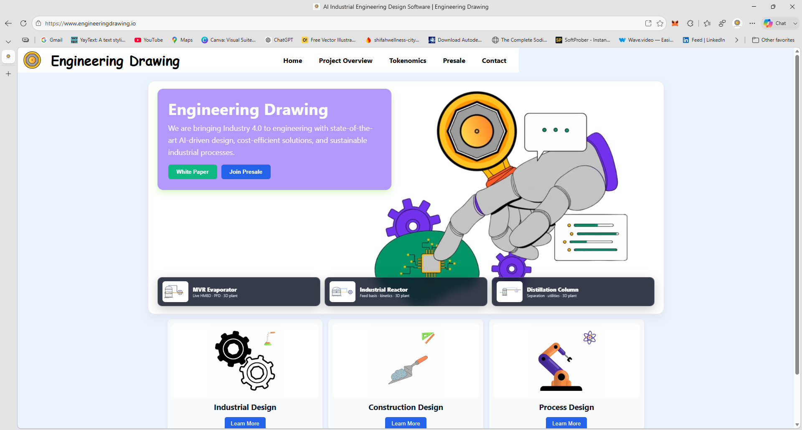
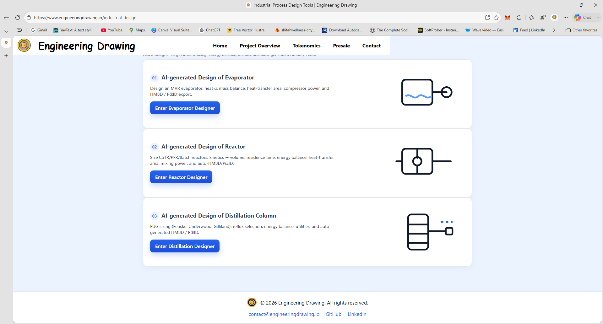
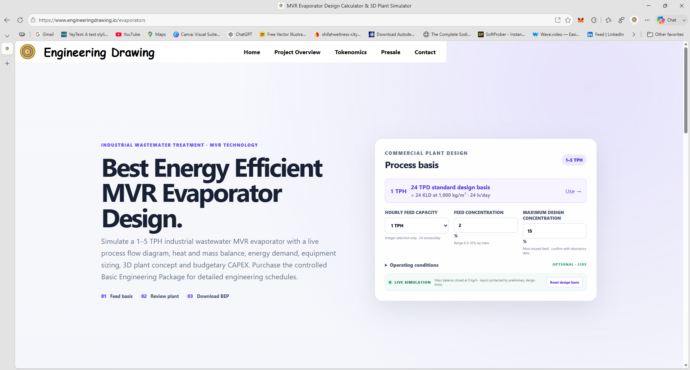
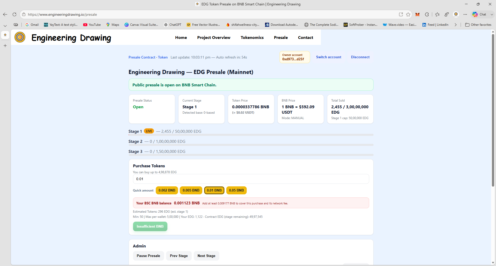

<div align="center">

# 🚀 EngineeringDrawing.io

### AI Copilot for Industrial Engineering

**Design • Simulate • Optimize • Build**

<p>
  <a href="https://engineeringdrawing.io"><strong>🌐 Website</strong></a> •
  <a href="https://github.com/rehanether/Engineering-Drawing"><strong>📦 Repository</strong></a>
</p>


</div>

---

## 🌍 Overview

EngineeringDrawing.io is an AI-powered industrial engineering platform that combines Artificial Intelligence, Process Engineering, and Web3 technologies to simplify industrial design workflows.

The platform enables engineers to design, simulate, optimize, and document industrial systems while leveraging blockchain technology for transparency and security.

Our vision is to build the **AI Copilot for Industrial Engineering** and accelerate the adoption of Industry 4.0 technologies.

---

# ✨ Key Features

- 🤖 AI Engineering Assistant
- 🏭 Industrial Process Design
- 📊 Process Simulation
- 📄 PFD Generator
- ⚙️ P&ID Generator
- 🔥 Heat Exchanger Design
- 💧 Evaporator Design
- 🧪 Reactor Design
- 🏗 Distillation Design
- 📑 Engineering Documentation
- 🌐 Web3 Wallet Integration
- ⛓️ BNB Smart Chain Support

---

# 📸 Product Showcase

## 🏠 Homepage



---

## 🏭 Industrial Design



---

## 💧 Evaporator Design



---

## 🌐 Wallet Integration



---

# ⚙️ Technology Stack

## Frontend

- React
- JavaScript
- HTML5
- CSS3

## Backend

- Node.js
- Express.js

## Blockchain

- Solidity
- Ethers.js
- Web3.js
- BNB Smart Chain (BSC)

## Deployment

- Vercel

---

# ⛓️ Blockchain Integration

EngineeringDrawing.io is built on **BNB Smart Chain (BSC)** to provide secure, transparent, and scalable engineering workflows.

### Supported Network

- BNB Chain
- BNB Smart Chain (BSC)

---

# 🪙 Smart Contracts

## EDG Token (BEP-20)

```
0xa90Cc0137FDA4285Eaa6da0f7a5118A1432b2a76
```

## EDG Presale Contract

```
0x944483c8083827A8BF09c12cFC57DB6a5b22697A
```

---

# 🚀 Quick Start

```bash
git clone https://github.com/rehanether/Engineering-Drawing.git

cd Engineering-Drawing

npm install

npm start
```

---

# 📁 Project Structure

```
Engineering-Drawing
├── public
├── src
├── server
├── api
├── docs
├── README.md
└── package.json
```

---

# 🎯 Why EngineeringDrawing.io?

✅ AI-assisted engineering workflows

✅ Modern React-based web application

✅ Industrial equipment design modules

✅ Process simulation tools

✅ Blockchain-powered ecosystem

✅ Industry 4.0 ready

---

# 🗺️ Roadmap

- AI Copilot for Industrial Engineering
- Advanced Process Simulation
- Digital Twin Integration
- Industrial IoT
- Enterprise Dashboard
- Engineering Marketplace
- AI Design Automation
- Cross-chain Web3 Support

---

# 📖 Documentation

Additional engineering documentation is available inside the **docs/** directory.

---

# 🌐 Website

https://engineeringdrawing.io

---

# 📧 Contact

**Website**

https://engineeringdrawing.io

**Email**

contact@engineeringdrawing.io

---

# 📄 License

This project is licensed under the **MIT License**.

See the LICENSE file for details.

---

<div align="center">

## ⭐ Star this repository if you find it useful!

Built with ❤️ by the EngineeringDrawing.io Team

</div>
